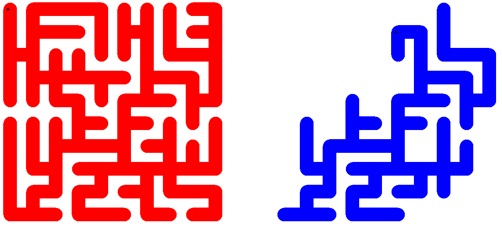

#Maze-Generation
>Script generates random mazes applying Prim's and Kruskal's *Minimum Spanning Tree* Algorithm.
* Well, both algorithms applied on same graph gives same maze obviously :no_good:

#Screenshot

